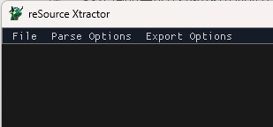
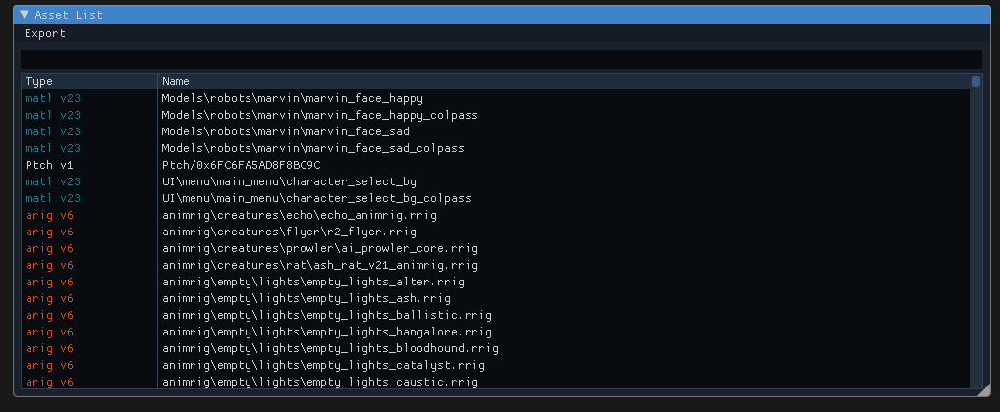

[RSX项目地址](https://github.com/r-ex/rsx)

注: RSX仅支持rpak文件(Respawn Pak File) 并不支持 mbnk 以及 vpk, 如想解析mbnk或者vpk文件请使用Legion+或HarmonyVPKTool

[HarmonyVPKTool项目地址](https://github.com/harmonytf/HarmonyVPKTool)

[Legion+](https://github.com/r-ex/LegionPlus)

# 使用
RSX目前似乎仅支持GUI模式而不支持命令行模式，所以你可能暂时无法使用命令行进行批处理。

### 导航栏

    File:
    	Load Pak: 加载rpak文件
    	Unload Pak: 清空当前加载的rpak文件
    	Load Model: 加载SMD模型(Source engine model)

    Parse Options:
    	Parse Threads: RSX在解析rpak文件时使用的线程数量，当你觉得加载很慢时可以增加线程数量（最大为CPU逻辑处理器数量）。

    Export Options:
        配置各个类型文件的导出格式以及导出时的线程数
    	mdl_ : CAST RMAX RMDL
    	uiia : PNG DDS
    	arig : CAST RMAX RRIG
    	uimg : PNG DDS
    	aseq : CAST RMAX RRIG
    	shdr : RAW MSW
    	txtr : PNG DDS
    	
    	Export Threads: RSX在导出文件时所使用的线程数量
### Assets_List

##### 导航栏
    
    Export
        Export selected : 导出你选中的数据
        Export all for selected type : 导出与选中项相同类型的数据
        Export all : 导出当前的所有数据

##### 搜索栏
你可以在这里输入一些关键词来搜索或屏蔽数据。

如果你想使用某个关键词搜索，那你可以直接输入你想要的关键词，例如：lifeline。
如果你想屏蔽一些东西，那么你可以使用 “-” + 屏蔽词来屏蔽一些内容，屏蔽词和搜索关键词可以使用“,”来分割。

这是一个的例子

    -.rrig,-.rseq,-txtr/,-uiia,-dtbl,-art\,rmdl,valk

        